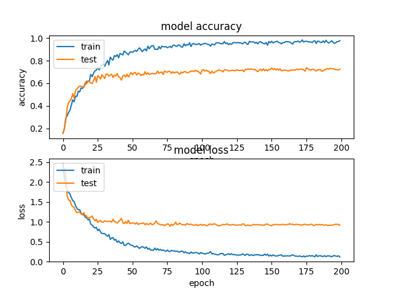

# music-genre-CNN

Example of Music genre classification using CNN approach from (https://github.com/keunwoochoi/music-auto_tagging-keras) and GTZAN Dataset

Dependencies:
```
keras==1.2.2
tensorflow-gpu==1.0
```

To run ```train.py``` some dependencies are needed:

- python-speech-features:
```
   cd music-genre-CNN
   git clone https://github.com/jameslyons/python_speech_features
```
Dataset:

- Download from: http://marsyasweb.appspot.com/download/data_sets/
- Copy the Dataset to data path ```music-genre-CNN/data```
```
cd music-genre-CNN
mkdir data
cp ~/path/to/download data
```
 <p align="left">
  
</p>
